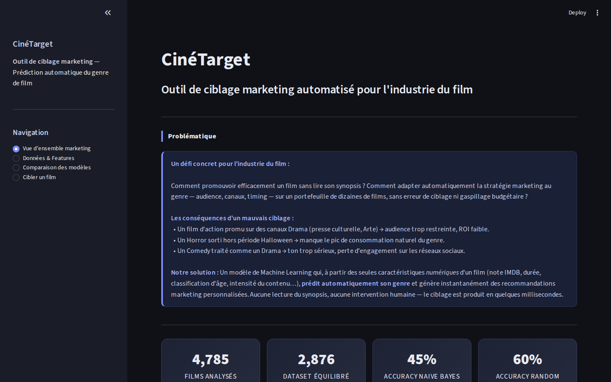
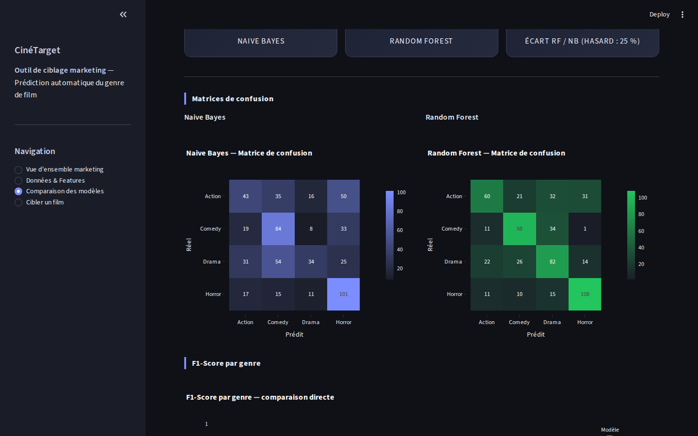
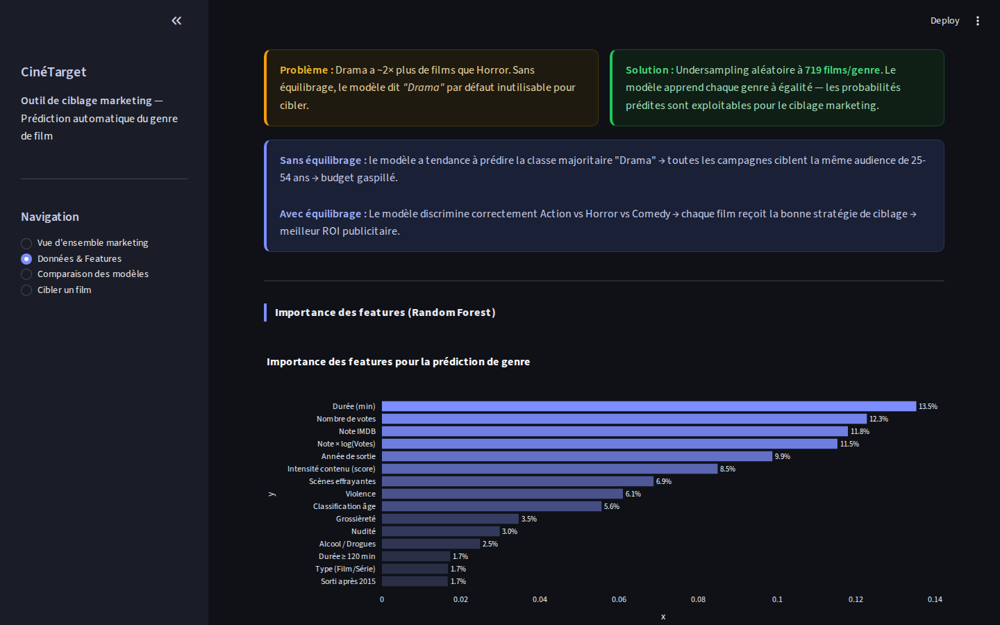
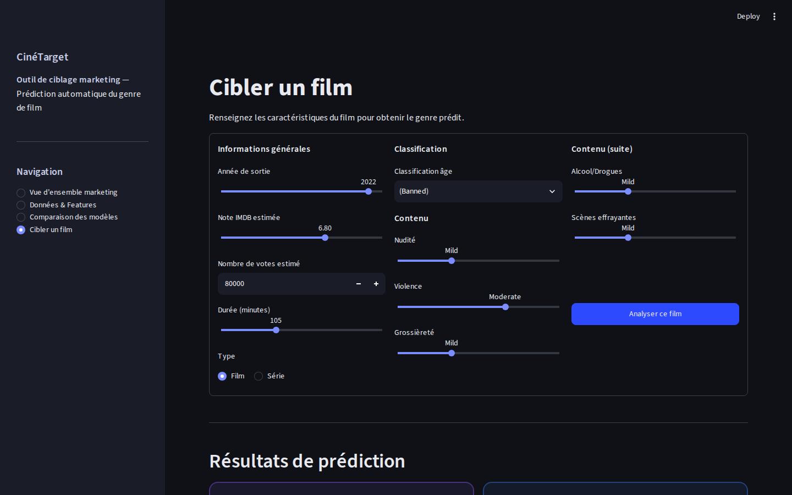

# CinéTarget — Prédiction du genre d'un film pour le ciblage marketing

Application **Streamlit** de classification supervisée qui prédit le genre d'un film (Action, Comédie, Drame, Horreur) à partir de ses seules caractéristiques numériques, sans lire le synopsis. Le genre prédit sert ensuite à proposer une stratégie marketing adaptée : audience, canaux, période de sortie, budget.

Projet de groupe réalisé à l'ECE Paris (majeure Data & IA), 2025/2026. Modèle principal : **Naive Bayes**, comparé à un **Random Forest**.

**▶ Essayer l'application en ligne :** [huggingface.co/spaces/edouardmnt04/CineTarget](https://huggingface.co/spaces/edouardmnt04/CineTarget). Elle s'exécute entièrement dans le navigateur, avec environ 1 minute de chargement au premier lancement.

**Stack :** Python · pandas · NumPy · scikit-learn (GaussianNB, RandomForest) · Plotly · Streamlit



---

## Démarche

1. **Données :** 6 178 titres IMDB (note, votes, durée, année, classification d'âge, type film ou série, et 5 niveaux de contenu sensible : nudité, violence, grossièreté, alcool, scènes effrayantes).
2. **Nettoyage :**
   - suppression de **1 155 doublons** (même titre, même année), qui faussaient l'évaluation ;
   - conversion des votes (`"1,234"` en nombre) ;
   - encodage ordinal des niveaux de contenu (`No Rate` < `Mild` < `Moderate` < `Severe`) ;
   - imputation des valeurs manquantes par la médiane.
3. **Cible :** un titre peut avoir plusieurs genres. On retient un genre principal, par ordre de priorité Horror > Action > Comedy > Drama.
4. **Feature engineering :** 4 variables créées, soit 15 au total :
   - intensité du contenu (somme des 5 niveaux) ;
   - note × log(votes) ;
   - film récent (sorti après 2015) ;
   - film long (120 min ou plus).
5. **Équilibrage :** Drama compte 2 fois plus de titres que Horror. Un sous-échantillonnage ramène chaque genre à 719 titres, pour que le modèle ne prédise pas la classe majoritaire par défaut.
6. **Modèles :** Naive Bayes gaussien (sur des variables normalisées Min-Max) et Random Forest de 200 arbres, évalués sur un jeu de test stratifié de 20 %.

## Résultats

| Modèle | Accuracy | F1 Action | F1 Comedy | F1 Drama | F1 Horror |
|---|---|---|---|---|---|
| Hasard (4 classes équilibrées) | 25 % | | | | |
| Naive Bayes gaussien | **45 %** | 0,34 | 0,51 | 0,32 | 0,57 |
| Random Forest | **60 %** | 0,48 | 0,66 | 0,53 | 0,72 |



**Analyse :**
- **Les deux modèles battent nettement le hasard (25 %).** Les genres ont donc une signature numérique réelle, surtout l'horreur (scènes effrayantes, violence) et la comédie.
- **Naive Bayes plafonne à 45 %**, car il suppose les variables indépendantes. Or elles sont fortement corrélées : l'intensité du contenu est la somme de la violence, de la nudité, etc. Le Random Forest capte ces interactions et gagne 15 points.
- **Action et Drama ont les F1 les plus faibles.** Drama est souvent confondu avec Comedy, et Action avec Drama ou Horror : leurs profils numériques se chevauchent.
- **Point méthodologique :** sans supprimer les doublons, le Random Forest affichait 70 %. Un même film pouvait se trouver à la fois dans le train et dans le test, ce qui gonflait le score de 10 points.



## L'application

| Page | Contenu |
|---|---|
| Vue d'ensemble marketing | Problématique, indicateurs clés, fiche marketing par genre |
| Données & Features | Effet de l'équilibrage, importance des variables |
| Comparaison des modèles | Accuracy, matrices de confusion, F1 par genre |
| Cibler un film | Formulaire, prédiction des deux modèles avec confiance, recommandation marketing |



Quand les deux modèles ne sont pas d'accord, l'application le signale et recommande une vérification humaine avant de lancer la campagne.

## Lancer l'application

```bash
pip install -r requirements.txt
streamlit run app.py
```

## Auteurs

Projet de groupe : **Clara Chalayer**, **Chloé Lestic** et **Édouard Menut**.

Autres projets d'Édouard : [Machine Learning](https://github.com/Edouardmnt/ECE-Machine-Learning-2025-2026) · [Data Science](https://github.com/Edouardmnt/ECE-Data-Science-2025-2026) · [Data Mining](https://github.com/Edouardmnt/ECE-Data-Mining-2025-2026) · [Big Data](https://github.com/Edouardmnt/ECE-Big-Data-2025-2026)
